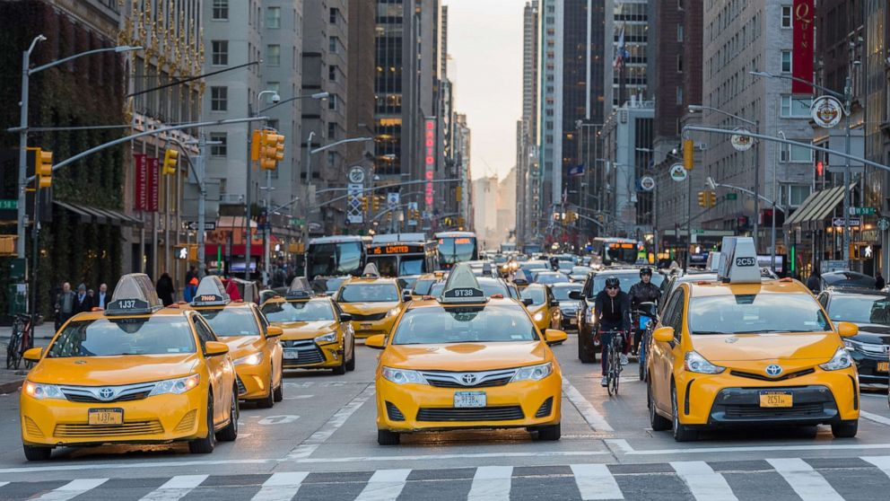

# nyc_taxi_ml

## NYC Taxi Fare and Trip Duration Prediction

## Links
[Official NYC web site](https://www.nyc.gov/site/tlc/about/tlc-trip-record-data.page)

[Fare and Duration Prediction: A Study of New York City Taxi Rides](https://cs229.stanford.edu/proj2016/report/AntoniadesFadaviFobaAmonJuniorNewYorkCityCabPricing-report.pdf)

[Towards Data Science - NYC Taxi Fare Prediction](https://towardsdatascience.com/nyc-taxi-fare-prediction-605159aa9c24)

[New York Yellow Taxi Demand prediction using Machine Learning (Optional)](https://medium.com/analytics-vidhya/new-york-yellow-taxi-demand-prediction-using-machine-learning-fc697d20ff86)

[Trip Record User Guide](https://www.nyc.gov/assets/tlc/downloads/pdf/trip_record_user_guide.pdf)

[Yellow Trips Data Dictionary](https://www.nyc.gov/assets/tlc/downloads/pdf/data_dictionary_trip_records_yellow.pdf)

[Taxi Zone Lookup Table (CSV)](https://d37ci6vzurychx.cloudfront.net/misc/taxi+_zone_lookup.csv)

[Taxi Zone Shapefile (PARQUET)](https://d37ci6vzurychx.cloudfront.net/misc/taxi_zones.zip)

### Dataset
[Yellow Taxi Trip Records (PARQUET) - May 2022](https://d37ci6vzurychx.cloudfront.net/trip-data/yellow_tripdata_2022-05.parquet)

